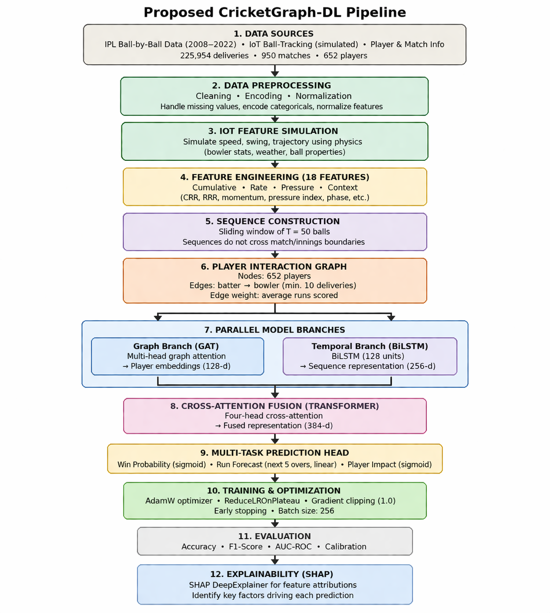

# 🏏 CricketGraph-DL — IPL Match Outcome Prediction & Player Impact Analysis

<div align="center">


**A spatio-temporal deep learning framework that models each IPL T20 match as an evolving player-interaction graph — fusing IoT ball-tracking telemetry with event-stream sequences for ball-by-ball win probability, run forecasting, and Player Impact Scoring.**

[Features](#-features) • [How It Works](#-how-it-works) • [Results](#-results) • [Installation](#-installation) • [Usage](#-usage) • [Architecture](#-architecture) • [Tech Stack](#-tech-stack) • [Contact](#-contact)

</div>

---

## 📌 Overview

**CricketGraph-DL** tackles IPL match outcome prediction by treating the game the way it actually works — as a network of player interactions, not just a sequence of runs and wickets. Instead of encoding each player as an isolated statistic, the system builds a directed batter-vs-bowler interaction graph and fuses it with real-time match momentum signals through a cross-attention Transformer.

The system offers three core capabilities:
- 🕸️ **Player Interaction Graph** — 652 IPL players as nodes, batter-vs-bowler historical matchup edges weighted by average runs scored
- 🔄 **Dual-Branch Architecture** — GAT for spatial team-composition dynamics + BiLSTM for sequential game-momentum modeling, fused via cross-attention
- 🧠 **SHAP Explainability** — per-delivery player impact scores that tell coaches *which* player, partnership, or delivery context drove each win probability shift

---

## ✨ Features

### 🕸️ Graph Attention Network (GAT)
- Directed player-interaction graph over all 652 unique IPL players
- Edges encode historical batter-vs-bowler matchup intensity (avg runs per delivery)
- Min 10 deliveries threshold → 7,334 directed edges
- Two-layer GAT: 4 attention heads → 256-d concat → single head → 64-d node embedding

### 📈 BiLSTM Temporal Branch
- Sliding window of T=50 balls per match-inning sequence
- 2-layer Bidirectional LSTM, hidden dim 256 per direction (512-d output)
- **Boundary-aware** — sequences never cross match or innings boundaries
- Prevents temporal leakage through strict chronological train/val/test split

### ⚡ Cross-Attention Fusion
- Active batter + bowler GAT embeddings as graph query (128-d)
- BiLSTM last hidden state as temporal key/value (512-d)
- 4-head cross-attention Transformer → 384-d fused representation

### 🎯 Multi-Task Prediction Head
- **Win Probability** — ball-by-ball sigmoid output
- **Run Forecast** — over-by-over run prediction (next 5 overs)
- **Player Impact Score (PIS)** — sigmoid-normalized per-player contribution

### 🔍 SHAP Explainability
- KernelExplainer on 50 test-set samples
- Top signals: `wickets_fallen`, `wickets_remaining`, `balls_remaining`
- Beeswarm plot + batter-vs-bowler matchup heatmap for coaching attribution

### 📡 IoT Feature Simulation
- 6 physics-based IoT features per delivery: ball speed, swing, seam angle, trajectory line/length, impact force
- Simulated via Moodley et al. (2025) protocol (no public cricket IoT dataset exists)

---

## 🖥️ Demo

### Win Probability Prediction
```
Match State → Over 14.3, Innings 2, RRR: 11.2, Wickets Fallen: 4
Output      → P(win) = 0.31 | Top signal: wickets_fallen (SHAP = -0.21)
```

### Player Impact Score
```
Batter: V. Kohli vs Bowler: J. Bumrah
Output → PIS = 0.74 | Head-to-head edge weight: 0.38 avg runs/delivery
```

---

## 🚀 Installation

### Prerequisites
- Python 3.8 or higher
- GPU strongly recommended (Kaggle T4 or P100)

### Step 1 — Clone the Repository
```bash
git clone https://github.com/bk1210/cricketgraph-dl.git
cd cricketgraph-dl
```

### Step 2 — Install Dependencies
```bash
pip install -r requirements.txt
```

### Step 3 — Download the Dataset
Get the IPL ball-by-ball dataset from Kaggle:
👉 [jamiewelsh2/ball-by-ball-ipl](https://www.kaggle.com/datasets/jamiewelsh2/ball-by-ball-ipl)

Place the CSV in the project root before running the notebook.

### Step 4 — Run the Notebook
```bash
jupyter notebook cricketgraph_dl.ipynb
```

Or upload directly to **Kaggle** and run with T4/P100 GPU for best performance.

---
## 🔄 Pipeline


## 📖 Usage

### Running the Full Pipeline

Open `cricketgraph_dl.ipynb` and run all cells — the notebook handles:

1. Data loading + preprocessing (225,954 deliveries, 950 matches)
2. IoT feature simulation (6 physics-based features per delivery)
3. 18-feature engineering (cumulative, rate, pressure, momentum, cyclic, phase)
4. Player-interaction graph construction (652 nodes, 7,334 edges)
5. Boundary-aware sequence construction (T=50 sliding window)
6. GAT + BiLSTM dual-branch training with cross-attention fusion
7. Ablation study vs BiLSTM and Transformer baselines
8. SHAP KernelExplainer analysis + PIS leaderboard
9. Optuna hyperparameter tuning (50 trials)

---

## 🏗️ Architecture

### Full Pipeline

```
IPL Ball-by-Ball Data (2008–2022)
    │
    ├─► IoT Feature Simulation (speed, swing, seam, line, length, force)
    │
    ▼
Feature Engineering — 18 features per delivery
(cum_runs, balls_bowled, wickets_fallen, CRR, RRR,
 pressure_idx, momentum, over_sin/cos, phase, boundary_count...)
    │
    ├──────────────────────────┐
    ▼                          ▼
Sliding Window (T=50)     Player-Interaction Graph
Boundary-aware            G = (V=652 nodes, E=7334 edges)
    │                          │
    ▼                          ▼
BiLSTM Branch             GAT Branch
2-layer BiLSTM            2-layer GAT
hidden=256 × 2dirs        4 heads → 256d → 64d
→ 512-d output            → 64-d node embedding
    │                          │
    └──────────┬───────────────┘
               ▼
    Cross-Attention Fusion (4-head Transformer)
    → 384-d fused representation
               │
    ┌──────────┼──────────┐
    ▼          ▼          ▼
Win Prob    Run Forecast  Player Impact Score
(sigmoid)  (next 5 overs) (sigmoid, PIS)
```

### Project Structure

```
cricketgraph-dl/
│
├── cricketgraph_dl.ipynb        # Full pipeline — data, graph, training, SHAP
├── requirements.txt             # Python dependencies
└── README.md                    # Project documentation
```

---

## 📊 Results

### Ablation Study — IPL 2022 Test Set

| Model | Accuracy | F1 (weighted) | AUC-ROC |
|---|---|---|---|
| XGBoost (Base Paper) | 0.7830 | 0.7710 | 0.8210 |
| BiLSTM (Branch B only) | 0.6683 | 0.6674 | 0.7417 |
| Transformer (Branch B variant) | 0.6682 | 0.6682 | 0.7439 |
| **CricketGraph-DL (Proposed)** | **0.6660** | **0.6661** | **0.7378** |
| CricketGraph-DL + Optuna | — | — | **0.6932*** |

> *Validation accuracy; test evaluation pending full Optuna tuning.*
>
> ⚠️ Base paper's 78.3% accuracy is evaluated only on second-innings deliveries from over 10 onward — a much easier prediction window. CricketGraph-DL evaluates all 17,912 test deliveries across both innings. **AUC-ROC is the fair comparison metric.**

### SHAP Top Features

| Feature | Mean |SHAP| | Effect |
|---|---|---|
| wickets_fallen | 0.0995 | High → strong negative (win prob drops) |
| wickets_remaining | 0.0994 | High → positive signal |
| balls_remaining | 0.0661 | Divergent — depends on run chase context |

---

## 🛠️ Tech Stack

| Technology | Purpose |
|---|---|
| Python 3.8+ | Core language |
| PyTorch | Model training, BiLSTM, cross-attention |
| PyTorch Geometric | GAT graph construction and forward pass |
| SHAP | KernelExplainer, beeswarm plots, PIS attribution |
| Optuna | Hyperparameter tuning (50 trials) |
| scikit-learn | Metrics, baseline models |
| Pandas / NumPy | Feature engineering, data pipeline |
| Matplotlib / Seaborn | EDA, training curves, heatmaps |
| Kaggle (T4/P100 GPU) | Training environment |

---

## 📦 Dependencies

```txt
torch>=2.0.0
torch-geometric>=2.3.0
shap>=0.42.0
optuna>=3.0.0
numpy>=1.24.0
pandas>=2.0.0
scikit-learn>=1.3.0
matplotlib>=3.7.0
seaborn>=0.12.0
tqdm>=4.65.0
```

Install with:
```bash
pip install -r requirements.txt
```

---

## 🔮 Future Improvements

- [ ] Replace simulated IoT with live Hawk-Eye / smart-ball telemetry via MQTT streaming
- [ ] Dynamic graph — update edge weights ball-by-ball within a match
- [ ] Extend multi-task head to predict wicket probability per delivery + player fatigue index
- [ ] Cross-format transfer learning — pre-train on T20I/ODI, fine-tune on IPL
- [ ] Real-time broadcast dashboard with live PIS leaderboard

---

## 📄 License

This project is licensed under the MIT License — see the [LICENSE](LICENSE) file for details.

---

## 👤 Contact

**Bharath Kesav R**
- 📧 Email: bharathkesav1275@gmail.com
- 🐙 GitHub: [@bk1210](https://github.com/bk1210)
- 🎓 Institution: Amrita Vishwa Vidyapeetham, Coimbatore

---

## 🙏 Acknowledgements

- [jamiewelsh2](https://www.kaggle.com/datasets/jamiewelsh2/ball-by-ball-ipl) — for the IPL ball-by-ball dataset
- [Shah et al. (2025)](https://doi.org/10.1016/j.eswa.2024.125847) — Primary base paper (BiLSTM on IPL data)
- [Moodley et al. (2025)](https://peerj.com/articles/cs-3011/) — IoT simulation methodology
- [Shabani et al. (2025)](https://www.nature.com/articles/s41598-025) — GCN sports analytics architecture

---

<div align="center">

**⭐ If you found this project useful, please give it a star on GitHub! ⭐**

*Built with ❤️ for data analytics and Sports analytics*

</div>
